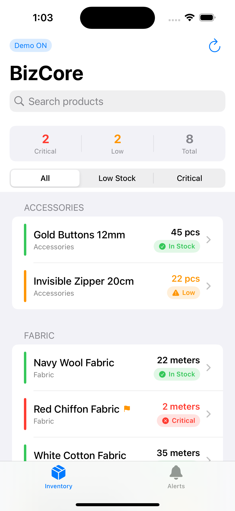
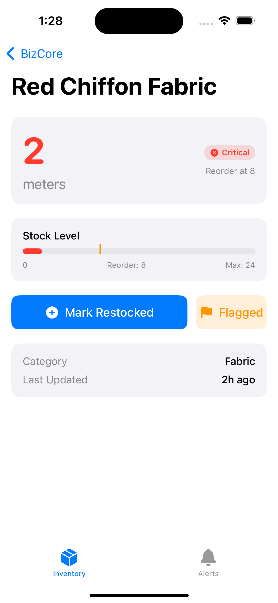
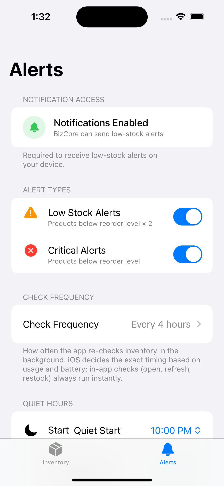

# BizCore Mobile

The shop owner is never at their desk when stock runs out. Their phone is always with them. iOS can push that alert. Desktop can't. That's why this app exists.

BizCore Mobile is a lightweight iOS inventory companion for [BizCore Desktop](#connection-to-bizcore-desktop) — a full ERP already running live in a real client's business. The client asked for low-stock alerts on their phone. I learned iOS to build it.

---

<!-- SCREENSHOT DAY (June 11):
     Replace the three blocks below with real simulator screenshots.
     Suggested filenames: screenshot-dashboard.png, screenshot-detail.png, screenshot-alerts.png
     Ideal size: 393×852 (iPhone 15 Pro simulator, no device frame needed)
-->

|                     Dashboard                      |                Product Detail                |                    Alerts                    |
| :------------------------------------------------: | :------------------------------------------: | :------------------------------------------: |
|  |  |  |
|       Critical · Low · In Stock at a glance        |      Stock level bar + one-tap restock       |     Notification settings · quiet hours      |

---

## What It Does

- **Live inventory dashboard** — products grouped by category, filterable by status (Critical / Low / All), full-text search
- **SwiftData offline cache** — inventory available without a connection; syncs on pull-to-refresh
- **Push notifications** — `UNUserNotificationCenter` alerts the moment any product drops below threshold, wherever the owner is
- **One-tap restock** — writes quantity back to the shared Supabase database in real time
- **Demo mode** — Al-Nour Boutique fictional inventory loads on first launch, no credentials needed

---

## Connection to BizCore Desktop

BizCore Mobile shares the same Supabase backend as **BizCore Desktop**, a full Electron + React + SQLite ERP built for the same client (Al-Khattaf). The desktop app handles purchase orders, bookkeeping, and reporting. The mobile app adds the one thing desktop can't: push alerts to the owner's phone.

```
┌─────────────────────┐        ┌──────────────────────┐
│   BizCore Desktop   │        │   BizCore Mobile     │
│  Electron · React   │◄──────►│  SwiftUI · SwiftData │
│  SQLite · Supabase  │        │  UNUserNotification  │
│                     │        │                      │
│  Full ERP — orders, │        │  Low-stock alerts    │
│  reports, invoices  │        │  wherever owner is   │
└─────────────────────┘        └──────────────────────┘
             │                           │
             └───────────┬───────────────┘
                   Supabase (shared)
                   products · inventory
```

BizCore Desktop is a private repo (client work). Available on request.

---

## Tech Stack


---

## Setup

<details>
<summary><strong>Run with real data (Supabase credentials required)</strong></summary>

1. Clone the repo
2. Create `Sources/BizCoreMobile/Config.plist`:

```xml
<?xml version="1.0" encoding="UTF-8"?>
<!DOCTYPE plist PUBLIC "-//Apple//DTD PLIST 1.0//EN"
  "http://www.apple.com/DTDs/PropertyList-1.0.dtd">
<plist version="1.0">
<dict>
    <key>SUPABASE_URL</key>
    <string>https://YOUR_PROJECT.supabase.co</string>
    <key>SUPABASE_KEY</key>
    <string>YOUR_ANON_KEY</string>
</dict>
</plist>
```

3. Open in Xcode 15+, target iOS 17 simulator or device
4. Tap **Demo OFF** in the top-left toolbar to switch to live data

`Config.plist` is in `.gitignore` — never committed.

</details>

<details>
<summary><strong>Run with demo data (no credentials needed)</strong></summary>

1. Clone the repo
2. Open in Xcode 15+, target iOS 17 simulator
3. Build and run — demo mode is **on by default**

The app opens with Al-Nour Boutique fictional inventory. Toggle demo mode at any time using the **Demo ON / Demo OFF** button in the top-left toolbar — no code change needed.

</details>

---

## Project Context

This is my first iOS app. I built it in ~2 weeks on a Windows machine (VS Code + borrowed Mac for Xcode compilation) because my client specifically asked for push notifications, and iOS was the only way to give them that reliably.

The learning order: Swift structs and value semantics → `@Observable` + `@State` ownership model → SwiftData persistence → `UNUserNotificationCenter` → `actor`-based concurrency. The desktop ERP already existed and worked. The mobile app was built to solve one specific gap the client identified.

---

## Author

**Eyas Mohammed** · Full-stack developer · Electrical Engineering student, Nusa Putra University  
[github.com/Eyasdm](https://github.com/Eyasdm)
